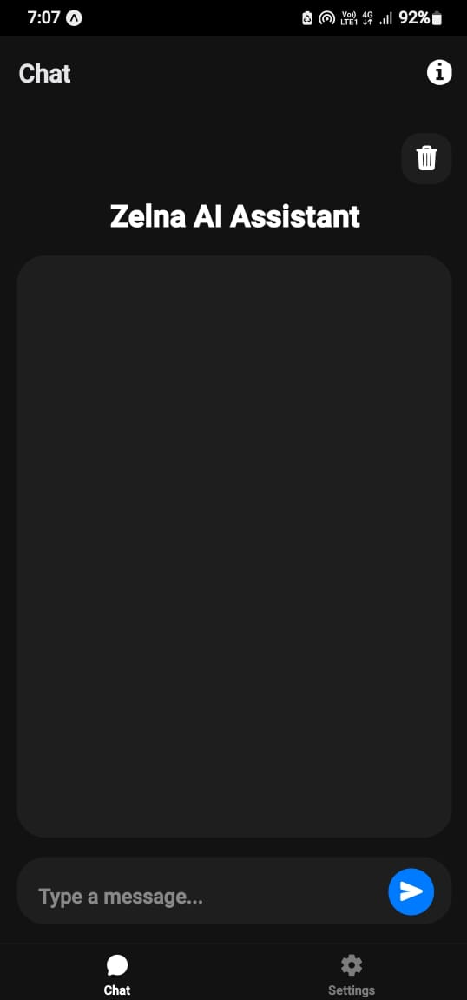
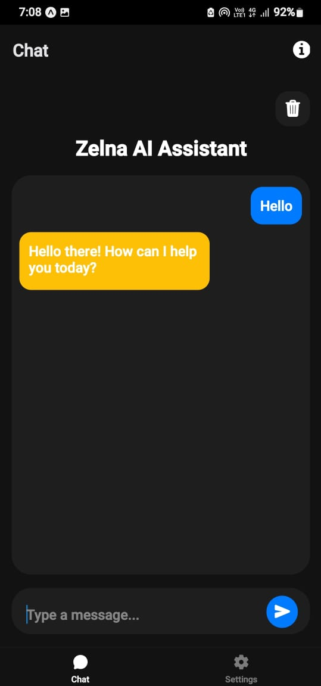

# Zelna: AI Assistant

An AI-powered mobile assistant built with **React Native + Expo**, designed to mimic the behavior of smart assistants on a portable device.

## 🔥 Features
- Voice output (coming soon)
- Text-based assistant replies
- Responsive UI using React Native
- Runs on Android, iOS, and web via Expo

## 📷 Screenshots




## 🚀 How to Run Locally

### Prerequisites
- Node.js
- Expo CLI (`npm install -g expo-cli`)

### Run the app:
```bash
git clone https://github.com/ankitsalve/zelna.git
cd zelna
npm install
npx expo start
